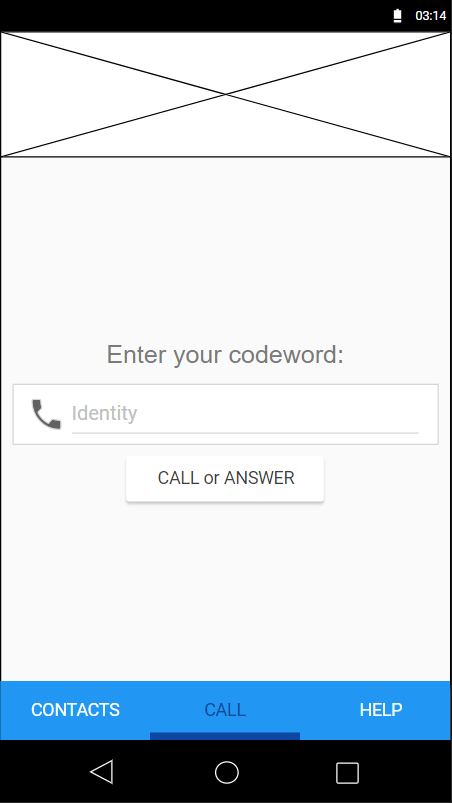
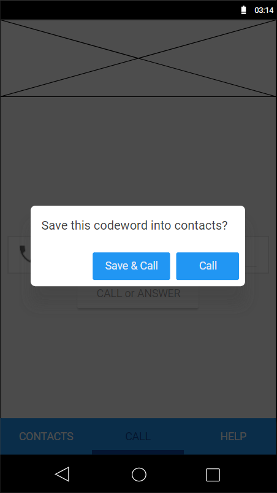
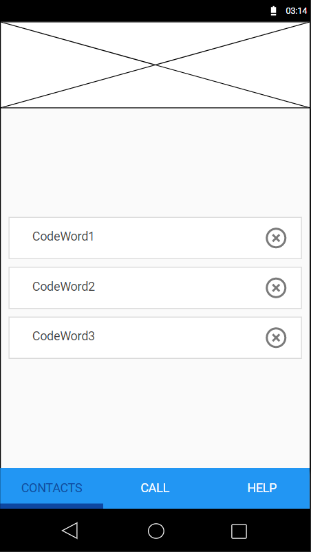
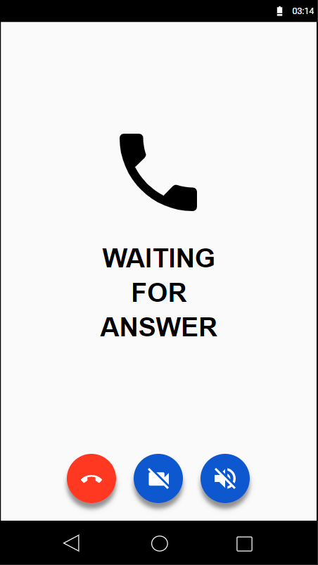
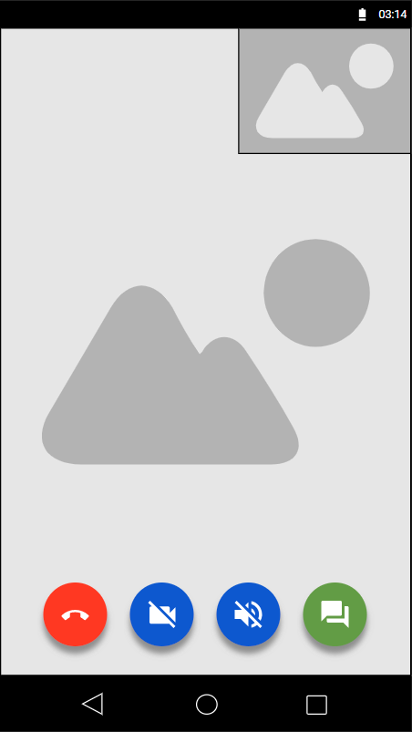
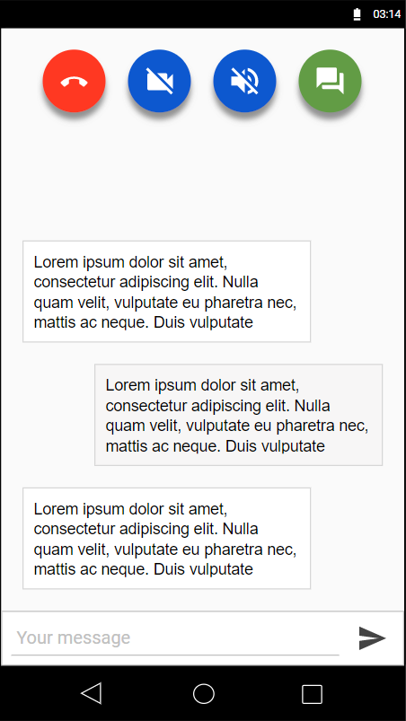
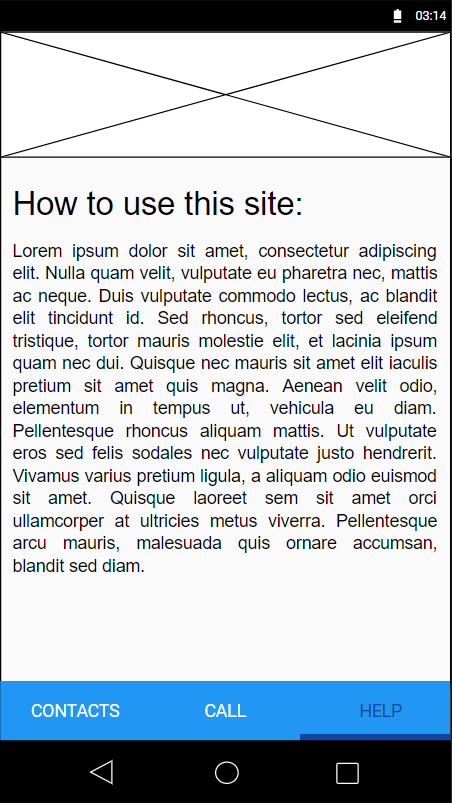

# P2Pvideo
## About the project
This project is a web application for making peer-to-peer video chat.

## Used technologies
### Frontend:
- Materialize
- jQusery
- PeerJs
- SCSS
- WebRTC
### Backend:
- PHP
- MySQL

## How to install
- Run Backend/init_db.sql.
- Configurate apache server for reaching Backend folder
- run `npm run build` on Frontend
- Configurate apache server for reaching Frontend folder. 
You should also configure SSL for your server because of the web-cam support.

## How to use this app
With this software you can make video calls on the internet via peer-to-peer WebRTC connection.  
You don't need to registrate or install any software.

### How to start a call
You need a "Codeword" for calling.  
This can be any word or expression, but needs to be unique.
#### Make the connection:
Two people needs to write the same codeword in same time on the `call page` and click the `CALL or ANSWER` button:  

#### Do I always needs to type the codeword?
No. You can save the codewords if you want. After making a call, the app will ask you to save the codeword.  
  
After saving the code, next time you can make a call from `contacts page` by clicking on a contact:  

#### I started the call
Now, you needs to wait for the other user to also starts the call, or you can stop waiting and abort the call.  

### Call started successfully 
You can see your partner and yourself. You can finish the call or turn on/off webcam and microfone.  
  
You can switch to the `chat view`, where you can send text messages:  
  
You can also use **\*BOLD\***, _\_ITALIC\__, &#96;CODE&#96; and &#96;&#96;&#96;MULTIPLE LINE CODE&#96;&#96;&#96; formatting tools.  
The chat section also recognises links and YouTube URLs.

### Cannot make a call
- Check your internet connection
- Try another codeword
- Your browser might not support WebRTC

### Other informations for using the app:
If you need some help about using the app you can see on the `help page`:  

## License

All rights reserved.  
Licensed under the [CC BY-NC-SA 4.0](https://creativecommons.org/licenses/by-nc-sa/4.0/legalcode) (**Attribution-NonCommercial-ShareAlike 4.0 International**)  
See LICENSE.md for more info.  
  
For commercial use, please contact [herczog.at97@gmail.com](herczog.at97@gmail.com).